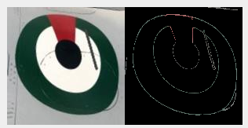
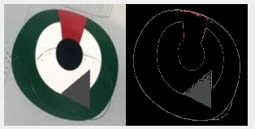
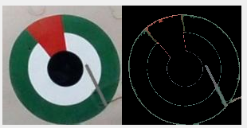
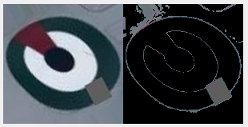

# This repository hosts the final project of the Deep learning system design Course

This study advocates for employing advanced computer vision methodologies, including the pre-trained YOLOv5 object detection algorithm and the VGG16 convolutional neural network, to revolutionize the visual examination procedures of aircraft logos. The dataset utilized in the research was meticulously sourced from the web and subjected to rigorous manual filtering to ascertain its quality. The primary objective of automating this process lies in augmenting its efficacy and precision, thereby conserving valuable time and resources currently expended on manual inspection.

To achieve this, the pre-trained YOLOv5 model was employed to detect and isolate logos, which were subsequently processed through the VGG16 model for classification purposes. Defective logos were further analyzed using an OpenCV color filter to identify any defects or inconsistencies. The proposed approach can significantly enhance the visual inspection process in the aviation industry.

